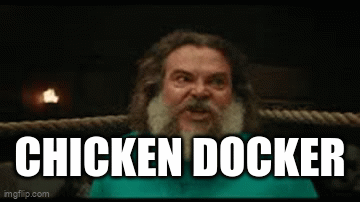

# Chicken Docker Project 🐔🐾

Este proyecto utiliza Docker para levantar los servicios necesarios, incluyendo backend y base de datos PostgreSQL.

## Levantar la aplicación con Docker 🚀

Sigue estos pasos:

1. Navega al directorio del proyecto:

```bash
cd /2025-G09-ChickenDocker
```
Importante: Asegúrate de que los finales de línea de los archivos estén en modo LF (\n).
Esto es necesario para que los scripts de Docker y Alembic funcionen correctamente.

Ejecuta Docker Compose para iniciar la aplicacion web:

docker compose up

posteriormente dirigase a esta pagina
```
http://localhost:5173
```




